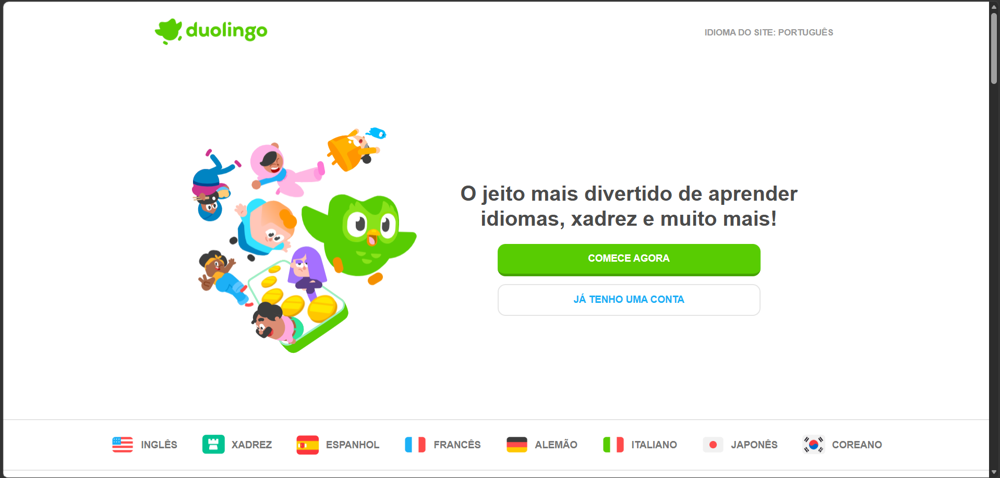
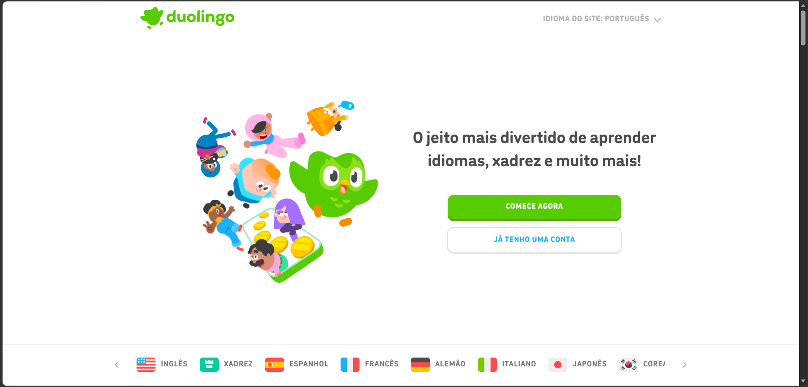
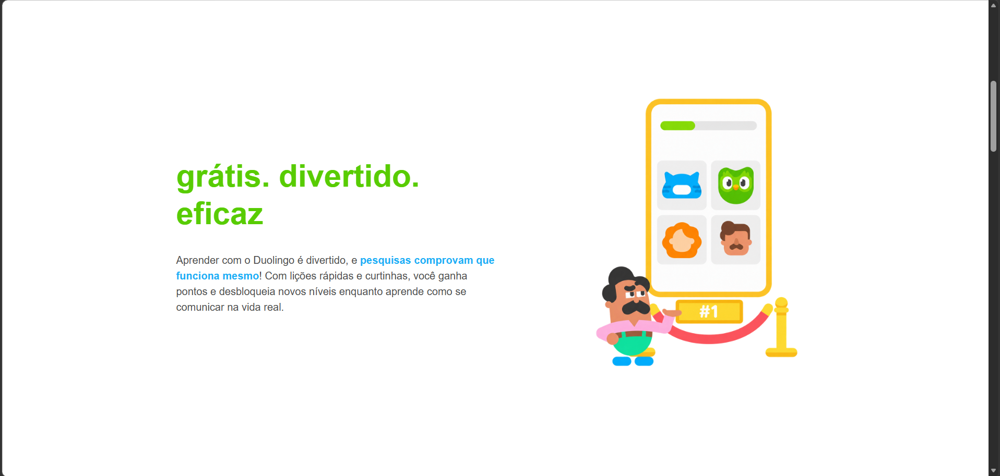
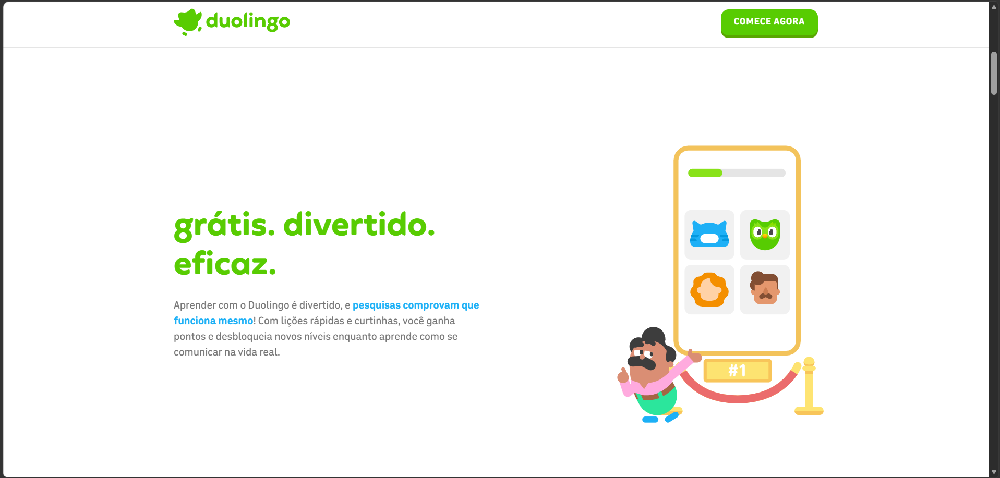
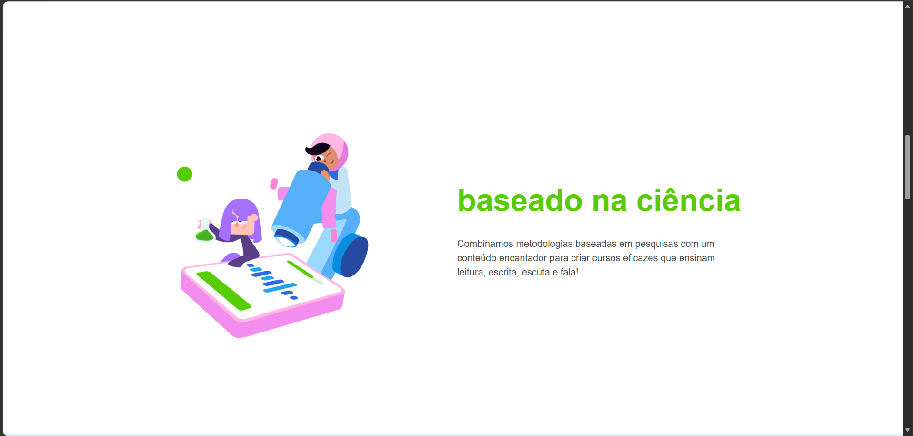
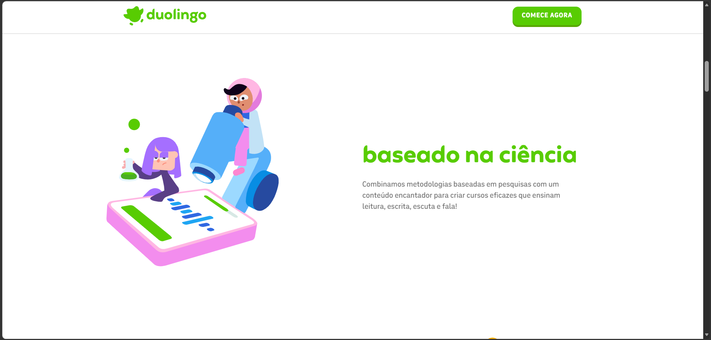
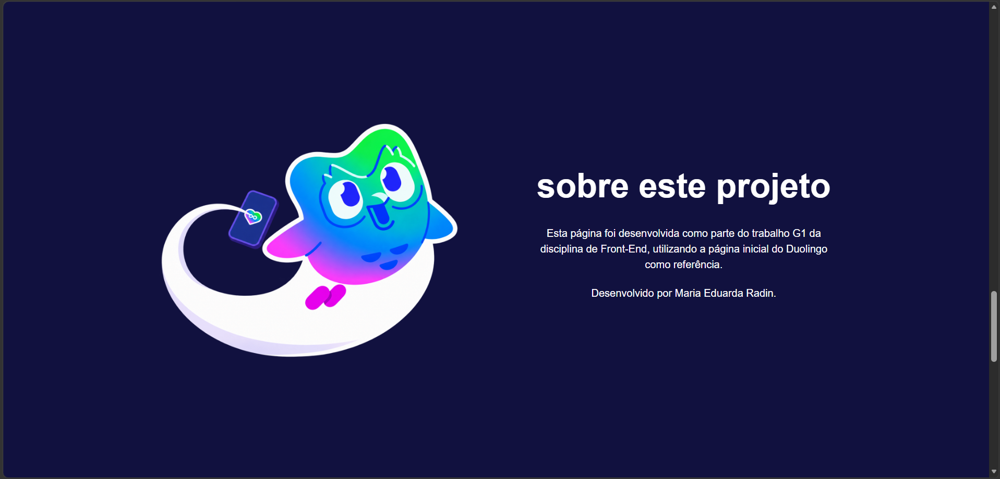
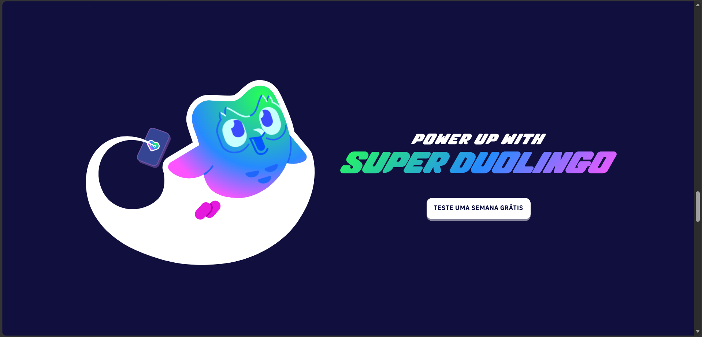
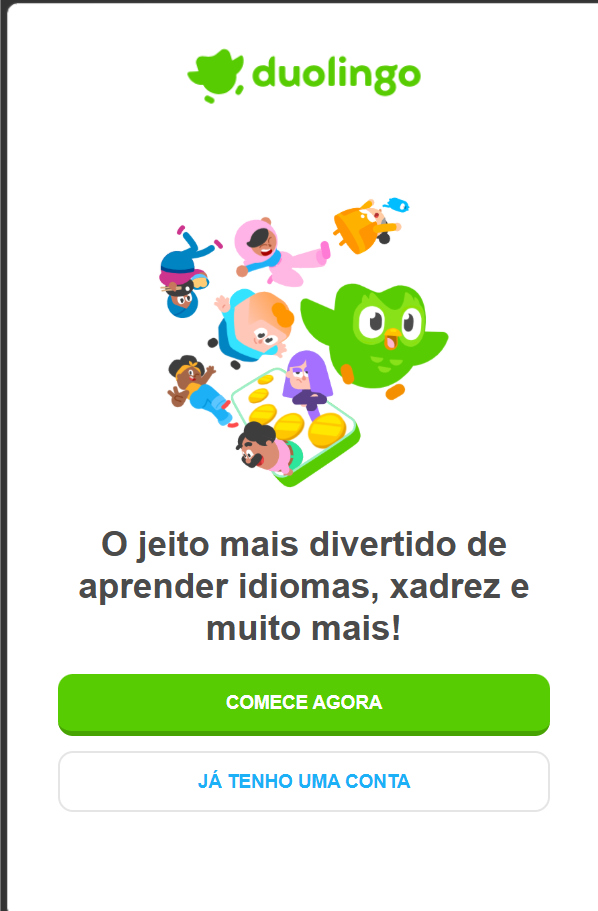

# Trabalho G1 - Front-End

**Nome:** MARIA EDUARDA RADIN

**RA:** 1139405

## Sobre o trabalho

Este projeto é o trabalho da G1 na disciplina de Front-End.

A proposta do trabalho é escolher uma página de um site que já existe como referência e desenvolver uma nova página usando HTML e CSS, buscando reproduzir a organização e as características visuais.

Para este trabalho, escolhi utilizar a página inicial do Duolingo como referência.

A escolha do Duolingo aconteceu principalmente porque é um site que eu já conhecia e que também é bastante utilizado por alguns dos meus amigos. Eles usam a plataforma tanto para praticar línguas que já sabem quanto para aprender idiomas novos.

Outro motivo foi por causa da organização da página. Ela tem diferença visual entre a versão para computador e a versão para celular. Isso me ajuda a trabalhar a responsividade no projeto e também posso tentar reproduzir as diferenças usando o que foi aprendido em aula.

**Página de referência:** https://pt.duolingo.com/

## Início do desenvolvimento

Depois de escolher a página que vai ser usada como referência, comecei criando a estrutura inicial do projeto.

A primeira versão do projeto foi simples, com o `index.html` e o `style.css` separados. Também criei uma pasta para deixar as imagens que iriam ser utilizadas na página.

O primeiro arquivo que comecei a montar foi o index.html. Nesse momento, a ideia era primeiro criar a estrutura da página e depois começar a trabalhar na aparência dela com CSS.

Fiz o primeiro commit para registrar o início do projeto antes de começar a adicionar as outras partes da página.

## Montando a primeira parte da página

Depois da estrutura inicial, escolhi qual parte da página do Duolingo iria reproduzir primeiro. Não tentei fazer ela inteira de uma vez, pois ela possui bastante conteúdo.

Nessa primeira parte coloquei:

- o logotipo;
- o botão de idioma do site;
- a imagem principal;
- o título;
- o botão "COMECE AGORA";
- o botão "JÁ TENHO UMA CONTA";
- a barra com os idiomas.

No HTML, procurei organizar essas partes da seguinte forma: O cabeçalho ficou dentro de header, a navegação dentro de nav e o conteúdo principal dentro de main, separado em section.

Também coloquei o alt nas imagens.

Aqui não estava tentando deixar tudo exatamente igual, primeiro queria conseguir montar a estrutura e fazer a página aparecer corretamente no navegador.

Para reproduzir a aparência da página precisei separar as imagens. A primeira imagem é o logotipo usado no cabeçalho e a segunda é a imagem principal que aparece na área de destaque da página.

## Começando o CSS

Depois de montar a estrutura HTML, comecei o style.css. Uma das primeiras coisas que fiz foi criar algumas variáveis para cores.

Algumas cores seriam usadas em mais de um lugar, então se for preciso mudar alguma delas, posso alterar o valor da variável em vez de procurar a cor em cada parte do arquivo.

Também fiz uma configuração inicial para retirar as margens e os espaçamentos padrão dos elementos.

## Ajustando a aparência inicial

Depois de organizar o CSS, comparei o resultado que aparecia no navegador com a página do Duolingo que estou usando de referência.

Tinham algumas partes bem diferentes, principalmente o tamanho da imagem principal, do título e o espaço entre os elementos. Fui fazendo alterações para tentar aproximar o resultado da página original.

Tive alguns problemas durante essa parte por causa de uns erros na escrita do CSS. Então a mudança que eu esperava acontecer depois da alteração no código não funcionava. Depois conferi o código e consegui encontrar o erro e corrigir.

## Trabalhando com a versão para celular

Na página original, não são só os elementos que ficam menores quando a tela diminui, a organização muda também. No celular, por exemplo, a imagem fica em cima do conteúdo e os botões um abaixo do outro.

Por isso, fiz pensando primeiro na tela menor e depois fazendo alterações para telas maiores usando uma media query.

Também tive dificuldades em acertar o tamanho dos elementos. A imagem estava ocupando muito espaço e os botões juntamente com o título precisaram de alterações para que ocupassem melhor o espaço.

## Trabalhando com a versão para telas maiores

Depois de deixar a tela menor com um visual aceitável, passei a trabalhar na versão para computador.

Usei o media query para mudar a organização conforme a tela vai ficando maior. 

Nessa versão, a imagem e o conteúdo ficam lado a lado. Também mudei o tamanho da imagem e do título, e a largura dos botões e da área do texto. Alguns valores precisaram ser ajustados comparando o resultado com a referência. 

A primeira versão ainda não ficou parecida com a referência. As diferenças que notei foram a distribuição dos elementos, o conteúdo e a barra de idiomas que ainda ficam em posições diferentes da página original.

## Comparando com a página original

Como eu estava tendo uma certa dificuldade para acertar os valores dos elementos, pesquisei no ChatGPT se existia alguma forma de descobrir o tamanho dos elementos, cores, fontes e espaçamentos.

Assim, ele recomendou utilizar a ferramenta de inspeção do navegador para tentar achar algumas dessas informações na página original. Já que eu não sabia como usar a ferramenta, pedi para o ChatGPT me explicar passo a passo do que precisava fazer, quais propriedades procurar e como interpretar os valores para que o resultado fosse o mais parecido com a página de referência.

Uma das partes que investiguei dessa forma foi a barra de idiomas da versão para computador. Consegui encontrar alguns valores relacionados.

Tentei alterar para esses novos valores, mas o resultado ainda não foi tão eficaz, novas mudanças vão precisar ser feitas.

## Continuando os ajustes

Utilizando a ferramenta de inspeção e comparando as duas páginas, fui fazendo novos ajustes no CSS.

Alguns elementos precisaram ser alterados várias vezes para ficarem o mais próximos da referência possível. O tamanho das imagens, a largura das áreas de conteúdo, os espaçamentos e o jeito como os textos quebravam de uma linha para outra eram o foco das mudanças que precisavam ser feitas.

Ao longo dos testes com os valores encontrados na inspeção da página original, percebi que não poderia usar os mesmos valores, pois a estrutura do meu projeto é diferente da estrutura do Duolingo. Então usei as informações como uma referência e fui adaptando para o meu CSS.

Durante esse processo fui testando as alterações tanto na versão de telas menores quanto na de telas maiores, pois algumas mudanças que funcionavam em uma não ficavam boas na outra.

## Adicionando outra parte da página

Depois de terminar os principais ajustes da primeira parte, comecei a reproduzir mais uma seção da página original.

Escolhi a seção "grátis. divertido. eficaz." que possui um título, um pequeno texto explicativo, um link e uma imagem.

Criei uma nova section no HTML e separei o texto e a imagem em divs. A imagem também recebeu um texto alternativo através do atributo alt.

Organizei essa seção para celular, onde o texto é centralizado e a imagem fica abaixo do conteúdo. Logo após, fiz os ajustes para a versão de computador dentro da media query, onde o texto e a imagem ficam lado a lado.

Uma das dificuldades dessa parte foi acertar a largura da área de texto porque, dependendo do valor utilizado, as frases quebravam em lugares diferentes da página original. Por isso, fui alterando a largura e comparando as duas páginas até chegar em uma quebra de texto mais parecida com a referência.

Também ajustei o espaço entre o texto e a imagem e o tamanho da ilustração separadamente para cada versão.

## Adicionando a seção "baseado na ciência"

A próxima seção escolhida para reproduzir foi "baseado na ciência", que tem um título, um texto explicativo e uma imagem.

Fiz uma nova section e separei o título e o texto e deixei a imagem abaixo deles. Fui comparando o resultado com a página original e alterando os tamanhos e espaçamentos para deixar a seção mais parecida com a referência.

A imagem estava menor do que a página original e também existiam diferenças no espaço entre o título, o texto e a imagem. Por isso, fui mudando esses valores aos poucos e comparando novamente as duas páginas.

## Adaptando a nova seção para telas maiores

Na versão para computador, a organização muda. A imagem fica do lado esquerdo e o texto do lado direito. Usando o flex-direction com row-reverse consegui fazer a mudança mantendo a mesma estrutura no HTML.

Uma das dificuldades aqui foi a largura da área de texto. Em uma das tentativas, o título "baseado na ciência" estava quebrando em duas linhas, diferente da página original. Fui alterando a largura disponível para o texto até conseguir deixar o título em uma única linha e aproximar a organização da referência.

Também fiz ajustes no tamanho da imagem, no espaço entre a imagem e o texto e nos espaçamentos da seção. Depois das alterações verifiquei novamente se tinham diferenças.

## Criando o formulário

Depois de finalizar as seções baseadas na página original, comecei a desenvolver o formulário solicitado nos requisitos do trabalho.

A página inicial do Duolingo que utilizei como referência não possui um formulário nessa parte da página. Por isso, criei um formulário próprio para o projeto, tentando manter as cores e o estilo visual do site.

Para essa seção, usei como inspiração uma parte da página original que possui um fundo azul claro e um título em azul escuro. No meu projeto, troquei o conteúdo original dessa seção por um formulário com os campos de nome, e-mail e idioma que a pessoa gostaria de aprender.

Cada campo possui um label associado ao seu input. Também adicionei um botão para enviar o formulário.

No CSS, criei novas variáveis para as cores utilizadas nessa parte e organizei os campos utilizando Flexbox.

Durante o desenvolvimento, fiz alguns testes com os tamanhos, espaçamentos e largura dos campos e do botão. Também tentei utilizar as ilustrações da seção original junto com o formulário, mas o resultado não ficou bom porque a imagem acabou ficando separada do restante do conteúdo. Por causa disso decidi manter apenas o fundo azul e deixar o formulário mais simples.

Para definir a altura da seção utilizei a unidade vh, fazendo com que ela tenha como altura mínima o tamanho da tela. Na versão para computador, diminuí a largura do formulário e aumentei o tamanho do título para aproveitar melhor o espaço.

## Criando uma seção personalizada

Depois de finalizar o formulário, criei uma nova seção para atender ao requisito de personalização do trabalho.

Para essa parte, utilizei como inspiração uma seção da página do Duolingo relacionada ao Super Duolingo. Na página original, essa seção possui um fundo azul escuro, uma ilustração e informações sobre o serviço.

No meu projeto, mantive a ideia visual, mas mudei o conteúdo para criar uma seção "sobre este projeto". Nela coloquei uma pequena explicação sobre o trabalho e também meu nome.

Utilizei uma ilustração do personagem e mantive o fundo azul escuro inspirado na página de referência. Essa seção não possui o mesmo conteúdo da página original, pois foi criada como uma personalização do projeto.

## Criando o rodapé

Para finalizar a página, criei um rodapé inspirado no rodapé da página original do Duolingo.

Na referência, o rodapé possui uma ilustração na parte superior e uma área verde com várias colunas de informação e links. Para o meu projeto, usei a imagem na parte superior e fiz uma versão mais simples das informações.

Dividi o conteúdo em três partes: "Sobre", "Projeto" e "Referência". Na parte "Sobre" coloquei alguns links relacionados ao Duolingo, na parte "Projeto" coloquei informações sobre o trabalho e na parte "Referência" adicionei um link para o site oficial do Duolingo.

Primeiro organizei o rodapé para a versão de celular, deixando as informações uma abaixo da outra. Depois fiz os ajustes para telas maiores dentro da media query, onde as três partes ficam distribuidas lado a lado.

Durante os ajustes, comparei novamente com a página original. Alterei a distribuição das colunas, o tamanho das letras e as cores dos links para aproximar o resultado da referência.

Também precisei trocar a imagem utilizada inicialmente no rodapé, porque ela perdia qualidade quando era aumentada na versão para computador. Depois de trocar consegui manter uma imagem maior e mais próxima da aparência da página original.

## Ajustando a barra de idiomas

Como ajustes visuais finais adicionei as imagens na barra de idiomas. No Duolingo, cada idioma possui uma pequena imagem ao lado do nome, como a bandeira do país ou um ícone no caso do xadrez.

Para aproximar mais o resultado da referência, fiz essa mudança e ajustei o tamanho e o alinhamento das imagens com os textos.

Também alterei o espaçamento da barra para deixar as linhas superior e inferior mais próximas dos elementos, tentando deixar a proporção parecida com a da página original.

## Diferenças em relação à página original

Durante o desenvolvimento tentei aproximar a página do projeto da página original do Duolingo, mas algumas diferenças foram mantidas.

Uma delas é a fonte utilizada. Ao inspecionar a página original, vi que o Duolingo usa uma fonte própria. No projeto mantive a fonte Arial, que já estava usando antes no CSS, por isso existem pequenas diferenças no formato.

Também reproduzi apenas algumas partes da página inicial usada como referência. O formulário e a seção "sobre este projeto" foram adicionados ao projeto para atender aos requisitos do trabalho e não fazem parte dessa forma na páginsa original.

O rodapé também foi simplificado, mantendo a ideia visual da referência, mas usando menos informações e colunas.

## Checklist dos requisitos

### 1.1 HTML semântico e acessibilidade

Utilizei elementos semânticos como `header`, `nav`, `main`, `section` e `footer` para organizar a estrutura da página.

As imagens possuem o atributo `alt` com uma descrição do conteúdo apresentado.

O projeto também possui um formulário com campos de nome, e-mail e idioma. Cada campo possui um `label` associado ao respectivo `input` através dos atributos `for` e `id`.

### 1.2 Fidelidade visual

A página inicial do Duolingo foi usada como referência durante todo o desenvolvimento. Comparei as duas páginas e fiz ajustes nos tamanhos das imagens, espaçamentos, cores, textos, botões e distribuição dos elementos.

Também utilizei a ferramenta de inspeção do navegador para consultar algumas características visuais da página original e usar essas informações como referência para os ajustes.

Algumas diferenças foram mantidas e estão explicadas na seção anterior.

### 1.3 CSS

O CSS foi desenvolvido em um arquivo chamado `style.css`.

Foram usados diferentes tipos de seletores, além de propriedades relacionadas ao box model, como `margin`, `padding`, `border` e `width`.

Também criei variáveis CSS em `:root` para armazenar algumas das principais cores utilizadas na página e reutilizá-las em diferentes elementos.

### 1.4 Responsividade

O projeto foi desenvolvido usando a ideia mobile first. O CSS base organiza a página pensando primeiro nas telas menores

Para telas maiores usei uma media query com `min-width: 768px`, alterando a organização e o tamanho de alguns elementos.

Também utilizei Flexbox para organizar os elementos das seções. A página foi testada em tamanhos de tela menores e maiores durante o desenvolvimento.

### 1.5 Personalização

Para personalizar o projeto, criei a seção "sobre este projeto".

Ela foi inspirada visualmente em uma seção do Duolingo, mas possui um conteúdo próprio explicando que a página foi desenvolvida para o trabalho G1 da disciplina de Front-End e apresenta também meu nome.

## Comparação com a página original

### Página inicial

**Projeto:**

**Referência:**

### Seção "grátis. divertido. eficaz."

**Projeto:**

**Referência:**

### Seção "baseado na ciência"

**Projeto:**

**Referência:**

### Seção personalizada

A seção "sobre este projeto" foi criada utilizando como inspiração visual a seção do Super Duolingo.

**Projeto:**

**Referência:**

### Versão para celular

Também comparei o resultado em uma tela menor para verificar a responsividade da página.

**Projeto:**

**Referência:**

